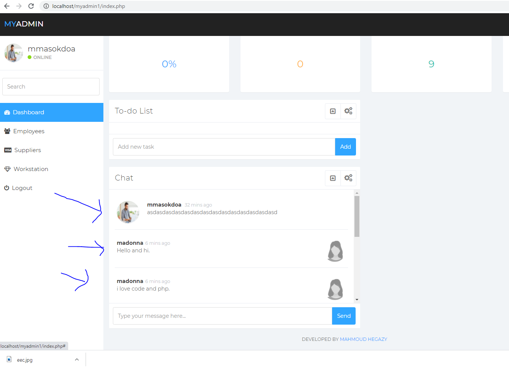
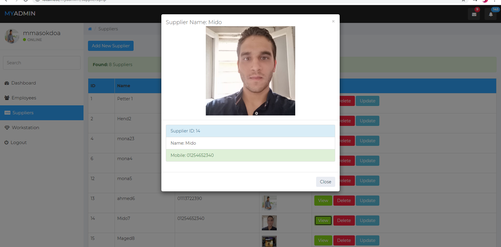
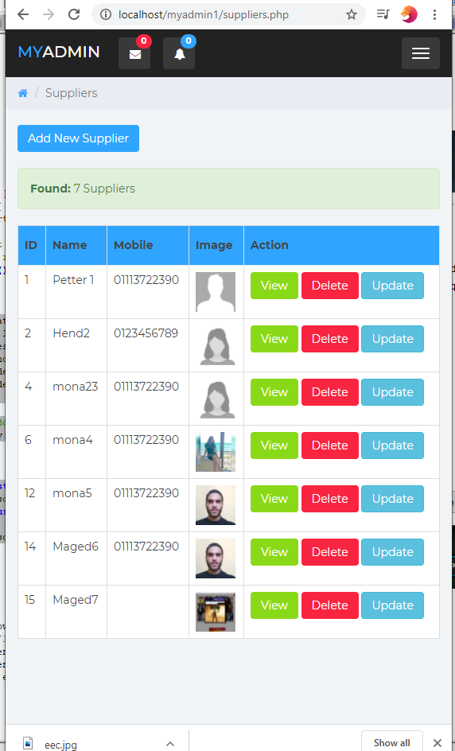
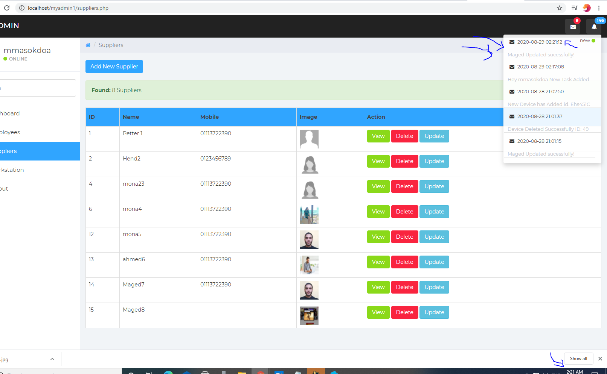
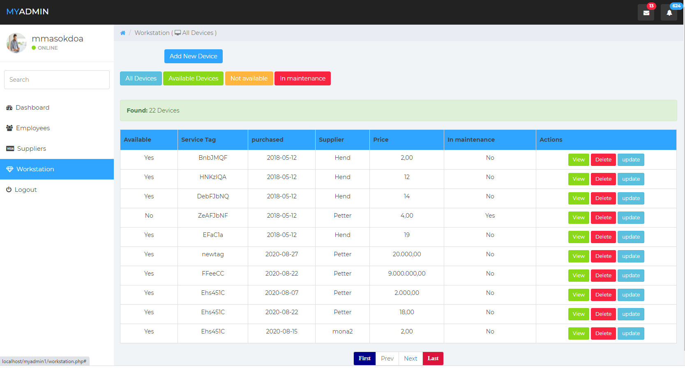
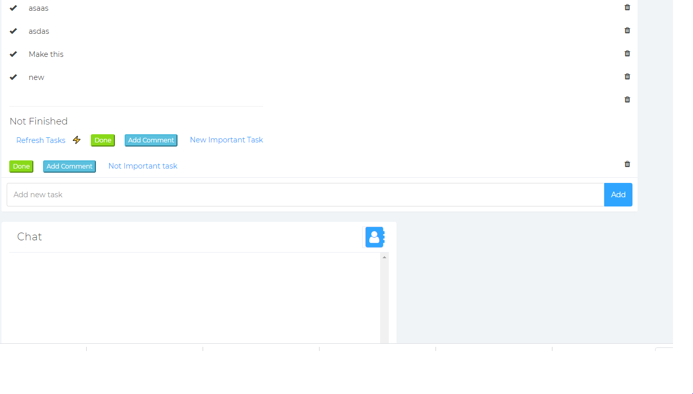
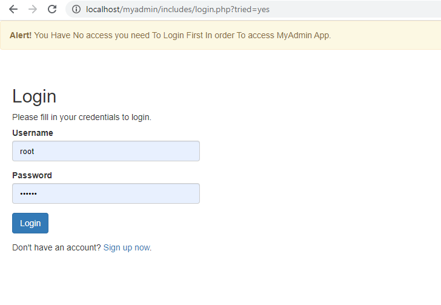

MyAdmin PHP APP for IT department.

### the app not published yet still some updates

## How to setup:
* use largon
* in phpMyadmin import database file included inside the app root dirctory (myadmin_db_ver2.7) create the db with name (myadmin)
* login in user and pass:
* username: mmasokdoa
* password: mmasokdoa
* note not allowed to create user without login (it's not public app)

# please read how to use APP before download it

*  I did in 10 lines something could take at least 4 pages to make it and more tables database
*  by using update we can now send device to matinace and autimaitc avail = n and vice versa app awesome
*  updated todo and task list, 2 features you can create normal task for u and close or delete it without make it offical
*  and another users can asgin tasks to other and will be apear in the reciver task as not finished and with it's stus
*  it will be able to add comment and make it done, then send it to archive and the asginer or medorator can check if the tasks finished or not
*  omg trello is noob app is is very good app think of it even company will stop use trello 

# myadmin_top
*  Last Version awesome not enogh.
*  This version, Have many things, No need to use trello, We can add new task for our self,
*  or assgin tasks for another users, define if task important, when we close the ticket we send notification to the assigner and archive that finished task 

#note
the company will stop using trello and use my app
becuase it has simple and smart todo list 

# Myadmin_CMS

PHP System CMS, secure and easy to use , full responsive, handle sessions, login, secuirty, sql  injection
you need laragon only to use it

## last added features:

1.  more secure from sql injection.
2.  Super Professional AJAX Live chat, I said Live becuase it updated automtic using AJAX.
3.  super Advanced notifications, updated live with AJAX.
4.  added pagination to make it more easy to use.

* download [https://laragon.org/]
* install it 
* now click on laragon start server, wait for apache and mySQL start
* extract it inside the laragon/www folder
* clone this repo
* visit php myadmin localhost/phpmyadmin
* create database must name is myadmin1
* inside myadmin1 folder you will find file name db click on  export on phpmyadmin and use this file
* it will create the database for you and my app can connet to it, wordpress need you to connect to database manually this not
* now visit localhost/myadmin1 and enter the user and password then start

* you can only register using localhost/includes/resgister.php when you loged I will close it any way

* user: mmasokdoa
* pass: mmasokdoa

